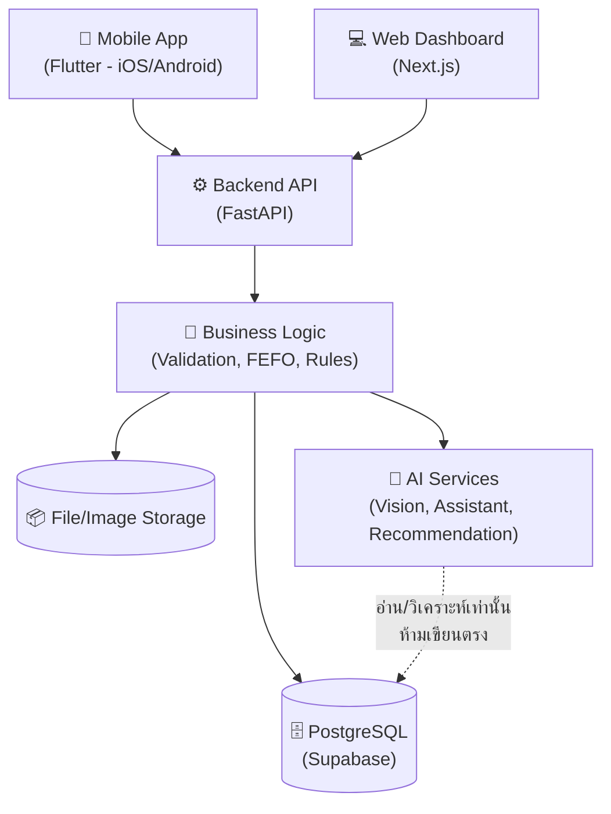
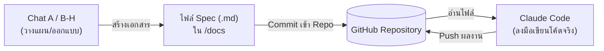

# Blueprint & Architecture Overview
## AI Pharmacy Management System

**สถานะเอกสาร:** ✅ อนุมัติแล้ว (Approved) — Phase 0 Complete
**จัดทำโดย:** Chat A — Architect / Project Manager
**Phase:** Phase 0 — Blueprint / Architecture
**อัปเดตล่าสุด:** กันยายน 2026
**อนุมัติโดย:** User

> เอกสารนี้เป็น **Source of Truth ระดับ Architecture** ของโปรเจกต์
> การเปลี่ยนแปลงใด ๆ ในเอกสารนี้ต้องผ่าน Change Control และได้รับอนุมัติจาก User ก่อนเสมอ

---

## 1. ภาพรวมโปรเจกต์ (Project Overview)

**ชื่อโปรเจกต์:** AI Pharmacy Management System

ระบบบริหารจัดการร้านขายยาที่ใช้ AI ช่วยอ่านข้อมูล วิเคราะห์ข้อมูล และช่วยตัดสินใจเกี่ยวกับสินค้า ยอดขาย สต็อก วันหมดอายุ การสั่งซื้อ และต้นทุน

**นิยามของระบบ:** ระบบนี้ไม่ใช่แค่ "โปรแกรมนับ Stock" แต่คือ **AI Pharmacy Decision Support System** — ระบบที่ช่วยให้เจ้าของร้านตัดสินใจได้ดีขึ้น ไม่ใช่แค่บันทึกข้อมูล

**Scope เวอร์ชันแรก:** ร้านเดียว (Single Pharmacy)
**ทิศทางระยะยาว:** ออกแบบ Architecture ให้ขยายเป็น Multi-tenant SaaS ได้ในอนาคต โดยไม่ต้องรื้อโครงสร้างใหม่ทั้งหมด

---

## 2. ปัญหาหลักที่ระบบต้องแก้ (Core Business Problems)

| # | ปัญหา | ผลกระทบ |
|---|---|---|
| 1 | **ยาหมดอายุ** — ติดตามวันหมดอายุด้วยมือยาก | เงินสูญเสีย, สต็อกค้าง |
| 2 | **สั่งยาเกินความจำเป็น** — ไม่เห็นภาพรวมก่อนสั่ง (สินค้าต่าง Brand/Supplier แต่ทดแทนกันได้) | เงินจมในสต็อกโดยไม่จำเป็น |
| 3 | **ต้นทุนแต่ละ Lot ไม่เท่ากัน** — ยาชนิดเดียวกันซื้อมาคนละราคาคนละครั้ง | คำนวณต้นทุน/กำไรผิดพลาด |

ระบบต้องช่วยตอบคำถามเหล่านี้ให้ผู้ใช้ได้เสมอ:
มีอะไรอยู่? → เหลือเท่าไหร่? → อะไรใกล้หมด? → อะไรใกล้หมดอายุ? → เงินจมอยู่กับอะไร? → ควรสั่งอะไร/เท่าไหร่/ทำไม?

---

## 3. Scope ของเวอร์ชันแรก (MVP Priority)

**Priority สูง (ต้องมีก่อน):**
1. Medicine Image AI (ถ่ายรูปยา → อ่านข้อมูล)
2. Invoice AI (อ่านใบส่งของ/ใบกำกับภาษี)
3. Lot / Expiry / Cost Tracking
4. Inventory Management
5. FEFO (First Expired, First Out)
6. Expiry Intelligence (แจ้งเตือนความเสี่ยงหมดอายุ)
7. AI Assistant (ถาม-ตอบภาษาธรรมชาติ)
8. AI Purchase Recommendation

**Priority รอง (เพิ่มทีหลังได้):**
9. Money Tied Up Analysis
10. Slow-moving Detection
11. Overstock Detection
12. Supplier Comparison
13. Original Invoice Storage
14. Daily AI Briefing
15. Invoice vs Actual Goods Verification

> หลักการ: **ใช้งานได้จริง + แก้ปัญหาหลัก + ไม่ซับซ้อนเกินไป** — ไม่จำเป็นต้องสร้างทุก Feature ตั้งแต่แรก

---

## 4. Technology Stack

| ส่วน | เทคโนโลยี |
|---|---|
| Mobile | Flutter (iOS, Android) |
| Web Dashboard | Next.js + TypeScript |
| Backend | FastAPI (Python) |
| Database | PostgreSQL |
| Managed Backend/DB Platform | Supabase |
| AI | AI API (OpenAI หรือ Provider ที่เหมาะสม — ยังไม่ตัดสินใจ ดูข้อ 11) |
| Storage | Supabase Storage |
| Notifications | FCM / APNs |
| Barcode | เพิ่มได้ในอนาคต |
| Version Control | GitHub (`icelolan-ai/AI-Pharmacy-Management-System`) |

> Technology Stack นี้เป็น **Initial Direction** — การเปลี่ยนแปลงต้องผ่าน Change Control (ข้อ 11 ใน Master Instructions)

---

## 5. High-Level Architecture



**หลักการสำคัญ:** Client (Mobile/Web) **ไม่เข้าถึง Database โดยตรง** — ทุกอย่างต้องผ่าน Backend API ซึ่งทำหน้าที่เป็น **Gatekeeper**

---

## 6. Data Model ภาพรวม (Conceptual — รายละเอียดเต็มอยู่ใน Phase 2)

**หลักการสำคัญ:** Medicine และ Lot ต้องแยกจากกันเสมอ

```
Medicine (Paracetamol 500mg)
 ├── Lot A: Qty 20, Cost 80฿, EXP 06/2027
 ├── Lot B: Qty 30, Cost 75฿, EXP 10/2027
 └── Lot C: Qty 50, Cost 68฿, EXP 12/2027
```

**Entity หลักที่ต้องมี (แนวคิด ไม่ใช่ Schema จริง):**
- `Medicine` — ข้อมูลสินค้าหลัก
- `MedicineLot` — แต่ละ Lot ที่รับเข้ามา (Cost, Expiry, Quantity แยกกัน)
- `Purchase` / `PurchaseItem` — การสั่งซื้อ
- `Invoice` — เอกสารต้นฉบับที่ AI อ่าน
- `Sale` / `SaleItem` — การขาย
- `InventoryTransaction` — บันทึกทุกการเปลี่ยนแปลง Stock (Purchase, Sale, Return, Adjustment, Damage, Expired)
- `Supplier`
- `AuditLog`

> การออกแบบ Schema จริง (Table, Relationship, Constraint) เป็นหน้าที่ของ **Chat E — Database/Supabase** ใน Phase 2

---

## 7. หลักการสำคัญของระบบ (Core Principles)

### 7.1 Backend เป็น Gatekeeper
Backend ควบคุม Business Logic และ Data Integrity ทั้งหมด — ตรวจสอบ Stock, Sales, Purchase, Lot, Expiry, Cost, Permission ก่อนบันทึกทุกครั้ง

### 7.2 AI ไม่ใช่ Source of Truth
AI มีหน้าที่ **อ่าน วิเคราะห์ จัดโครงสร้าง อธิบาย แนะนำ** เท่านั้น
AI **ห้าม**แก้ Stock/Cost/Lot/Expiry โดยตรง, ห้ามลบข้อมูล, ห้ามสร้าง Purchase โดยไม่ผ่าน Validation

### 7.3 Human Confirmation
ข้อมูลที่ AI อ่านจากรูป/เอกสาร ต้องให้ผู้ใช้ตรวจสอบก่อนบันทึกเสมอ:
```
Image → AI Extraction → Review → User Edit → User Confirm → Backend Validation → Database
```

### 7.4 FEFO (First Expired, First Out)
สินค้าที่หมดอายุก่อนต้องถูกขายก่อน ระบบต้องแนะนำ Lot ตามหลักนี้อัตโนมัติ สินค้าหมดอายุแล้วห้ามขายและต้องแยกออกจาก Stock ที่ขายได้

### 7.5 Data Integrity & Auditability
ทุกการเปลี่ยนแปลง Stock ต้องสร้าง Transaction เสมอ ห้ามแก้ตัวเลขแบบไม่มีประวัติ ทุก Critical Action ต้องตรวจสอบย้อนหลังได้ (ใคร/ทำอะไร/เมื่อไหร่/ก่อน-หลังเป็นอะไร)

### 7.6 AI Hallucination Prevention
AI ห้ามเดาข้อมูล Stock/Cost/Sales/Expiry — ถ้าไม่มีข้อมูลต้องตอบ "ไม่พบข้อมูลในระบบ" เท่านั้น

---

## 8. Multi-Tenant Readiness (ออกแบบไว้ล่วงหน้า — ไม่สร้างตอนนี้)

ระบบเริ่มต้นสำหรับร้านเดียว แต่ Data Model และ Architecture จะเผื่อโครงสร้างสำหรับ:
- `store_id` ในตารางหลัก (เผื่อไว้ แต่ยังไม่ใช้งานจริงในเวอร์ชันแรก)
- แนวคิด User/Role/Permission ที่ขยายเป็น Multi-store ได้ในอนาคต

> **หลักการ:** เผื่อโครงสร้างไว้ แต่ไม่เพิ่มความซับซ้อนของ Multi-tenant ในเวอร์ชันแรก (MVP Principle)

---

## 9. Development Environment & Workflow

### 9.1 เครื่องมือที่ใช้งานจริง (ยืนยันแล้ว)

| เครื่องมือ | สถานะ |
|---|---|
| GitHub Repository | ✅ พร้อม (`icelolan-ai/AI-Pharmacy-Management-System`) |
| Claude Code (บน PC ผ่าน Claude Desktop) | ✅ เชื่อมต่อและ Verified แล้ว |
| GitHub Desktop | ✅ มีอยู่ในเครื่อง (ใช้เสริมได้) |
| การทำงานนอกสถานที่ (iPad/iPhone) | ผ่าน Claude App เชื่อมต่อ Remote Control ไปยัง PC (ต้องเปิด PC ทิ้งไว้) |
| Supabase Account | ⏳ ยังไม่ได้สร้าง — ต้องเตรียมก่อน Phase 2 |
| AI API Account | ⏳ ยังไม่ได้สร้าง — ต้องเตรียมก่อน Phase 6 |

### 9.2 Document Bridge Workflow

Claude.ai Project (Chat A–H) และ Claude Code เป็นคนละระบบ ไม่เชื่อมกันอัตโนมัติ — เชื่อมกันผ่าน**เอกสาร**ที่ Commit เข้า Repository:



### 9.3 โครงสร้างโฟลเดอร์เอกสาร (ตกลงร่วมกัน)

```
AI-Pharmacy-Management-System/
└── docs/
    ├── 00-blueprint.md          ← เอกสารนี้ (Chat A)
    ├── 01-database-schema.md    ← Chat E (Phase 2)
    ├── 02-api-spec.md           ← Chat D (Phase 3)
    ├── 03-ai-design.md          ← Chat F (Phase 6-7)
    ├── 04-mobile-spec.md        ← Chat B (Phase 4)
    ├── 05-web-spec.md           ← Chat C (Phase 5)
    ├── 06-ui-design.md          ← Chat G
    └── 07-test-plan.md          ← Chat H (Phase 10)
```

---

## 10. Phase Roadmap

| Phase | ชื่อ | สถานะ |
|---|---|---|
| 0 | Blueprint / Architecture | ✅ เสร็จสมบูรณ์ |
| 1 | Foundation | ⏳ รอเริ่ม |
| 2 | Database / Medicine Model | ⏳ รอ |
| 3 | Backend API | ⏳ รอ |
| 4 | Mobile App | ⏳ รอ |
| 5 | Web Dashboard | ⏳ รอ |
| 6 | AI Vision / Document AI | ⏳ รอ |
| 7 | AI Assistant | ⏳ รอ |
| 8 | Inventory Intelligence | ⏳ รอ |
| 9 | Integration | ⏳ รอ |
| 10 | Testing / Security | ⏳ รอ |
| 11 | Production | ⏳ รอ |

แต่ละ Phase ต้องผ่าน **Phase Gate**: Plan → Prerequisite Check → Dependency Check → User Approval → Implementation → Testing → Review → Chat A Approval → Phase Complete

---

## 11. ประเด็นที่ต้องตัดสินใจเพิ่มเติม (Open Decisions)

รายการนี้**ไม่ใช่การตัดสินใจของ Chat A** — เป็นประเด็นที่ต้องเสนอให้ User พิจารณาก่อนถึง Phase ที่เกี่ยวข้อง:

| ประเด็น | ต้องตัดสินใจก่อน Phase | สถานะ |
|---|---|---|
| เลือก AI Provider (OpenAI/อื่นๆ) และงบประมาณ Cost | Phase 6-7 | ⏳ ยังไม่ทราบ |
| สร้าง Supabase Account | Phase 2 | ⏳ ยังไม่ทำ |
| งบประมาณรวมของโปรเจกต์ (Cloud, AI API) | ก่อน Production | ⏳ ยังไม่ทราบ |

---

## 12. ขั้นตอนถัดไป (Next Steps)

1. ✅ User อนุมัติเอกสารนี้แล้ว
2. นำไฟล์นี้ไป Commit เข้า Repo ที่ `docs/00-blueprint.md`
3. Chat A จะเริ่มวางแผน **Phase 1 — Foundation** ต่อ (โครงสร้างโปรเจกต์เบื้องต้น, Environment Setup) เมื่อ User สั่งเริ่ม

---

**หมายเหตุ:** เอกสารนี้ผ่าน Phase Gate ครบถ้วนแล้ว (ตามข้อ 59) ถือเป็น Source of Truth ระดับ Architecture ของโปรเจกต์นี้ การเปลี่ยนแปลงใด ๆ ต่อจากนี้ต้องผ่าน Change Control (ข้อ 56)
