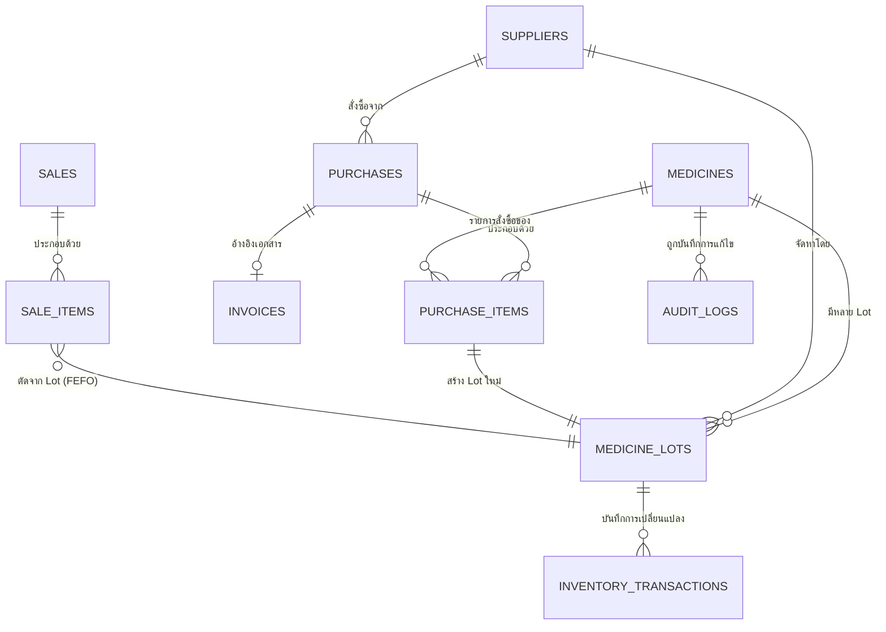

# Database Schema Design
## AI Pharmacy Management System — Phase 2

**สถานะเอกสาร:** ✅ อนุมัติแล้ว (Approved) — พร้อมให้ Claude Code นำไปดำเนินการ
**จัดทำโดย:** Chat A — Architect / Project Manager (บทบาท Chat E — Database/Supabase)
**Phase:** Phase 2 — Database / Medicine Model
**อัปเดตล่าสุด:** กันยายน 2026
**อนุมัติโดย:** User

> อ้างอิงหลักการจาก [`00-blueprint.md`](./00-blueprint.md) ข้อ 6-7 (Data Model, Core Principles)
> Database: PostgreSQL ผ่าน Supabase Project `ai-pharmacy-management` (Singapore Region)

---

## 1. หลักการออกแบบ (ทบทวนจาก Blueprint)

1. **Medicine กับ Lot ต้องแยกจากกันเสมอ** — ต้นทุนและวันหมดอายุอยู่ระดับ Lot ไม่ใช่ระดับ Medicine
2. **ทุกการเปลี่ยนแปลง Stock ต้องมี Transaction** — ห้ามแก้ตัวเลขตรง ๆ โดยไม่มีประวัติ
3. **รองรับ FEFO** — ต้อง Query หา Lot ที่ใกล้หมดอายุที่สุดได้ง่าย
4. **Auditability** — ทุกการแก้ไขข้อมูลสำคัญต้องบันทึกว่าใคร/เมื่อไหร่/ก่อน-หลังเป็นอะไร
5. **เผื่อ Multi-tenant ในอนาคต** — ใส่ `store_id` ไว้ในตารางหลัก แต่ยังไม่ Enforce การใช้งานจริงในเวอร์ชันแรก

---

## 2. ER Diagram (ภาพรวมความสัมพันธ์)



---

## 3. รายละเอียดตาราง (Table Definitions)

### 3.1 `medicines` — ข้อมูลสินค้าหลัก

| Column | Type | Constraint | คำอธิบาย |
|---|---|---|---|
| id | uuid | PK, default gen_random_uuid() | |
| store_id | uuid | nullable (เผื่อ Multi-tenant อนาคต) | |
| name | text | not null | ชื่อยา เช่น Paracetamol |
| generic_name | text | nullable | ชื่อสามัญทางยา |
| strength | text | nullable | ความแรง เช่น "500mg" |
| dosage_form | text | nullable | รูปแบบยา เช่น Tablet, Syrup |
| manufacturer | text | nullable | ผู้ผลิต |
| category | text | nullable | หมวดหมู่ยา |
| barcode | text | nullable, unique | สำหรับ Barcode Scanner ในอนาคต |
| active_ingredient | text | nullable | ใช้ช่วย Matching สินค้าคล้ายกัน |
| reorder_point | integer | nullable | จุดสั่งซื้อซ้ำ (ใช้ในภายหลัง) |
| is_active | boolean | default true | ยกเลิกขายแล้วหรือยัง |
| created_at | timestamptz | default now() | |
| updated_at | timestamptz | default now() | |

### 3.2 `suppliers` — ผู้จำหน่าย

| Column | Type | Constraint | คำอธิบาย |
|---|---|---|---|
| id | uuid | PK | |
| store_id | uuid | nullable | |
| name | text | not null | |
| contact_person | text | nullable | |
| phone | text | nullable | |
| email | text | nullable | |
| address | text | nullable | |
| lead_time_days | integer | nullable | ใช้คำนวณ Low Stock |
| created_at | timestamptz | default now() | |
| updated_at | timestamptz | default now() | |

### 3.3 `medicine_lots` — Lot แต่ละชุดที่รับเข้ามา ⭐ (ตารางสำคัญที่สุด)

| Column | Type | Constraint | คำอธิบาย |
|---|---|---|---|
| id | uuid | PK | |
| medicine_id | uuid | FK → medicines.id, not null | |
| supplier_id | uuid | FK → suppliers.id, nullable | |
| purchase_item_id | uuid | FK → purchase_items.id, nullable | Lot นี้เกิดจากการซื้อรายการไหน |
| lot_number | text | not null | เลข Lot/Batch จากผู้ผลิต |
| quantity_received | integer | not null, check >= 0 | จำนวนที่รับเข้ามาตอนแรก |
| quantity_remaining | integer | not null, check >= 0 | จำนวนคงเหลือปัจจุบัน |
| cost_per_unit | numeric(10,2) | not null, check >= 0 | ต้นทุนต่อหน่วยของ Lot นี้ |
| expiry_date | date | not null | วันหมดอายุ |
| received_date | date | not null, default current_date | |
| status | text | check in ('active','expired','depleted','damaged') | สถานะของ Lot |
| created_at | timestamptz | default now() | |
| updated_at | timestamptz | default now() | |

> **Index สำคัญ:** `(medicine_id, expiry_date)` — ใช้เร่งความเร็ว Query แบบ FEFO
> **Index:** `(status, expiry_date)` — ใช้สำหรับ Expiry Intelligence Dashboard

### 3.4 `purchases` — การสั่งซื้อ/รับสินค้า

| Column | Type | Constraint | คำอธิบาย |
|---|---|---|---|
| id | uuid | PK | |
| store_id | uuid | nullable | |
| supplier_id | uuid | FK → suppliers.id, not null | |
| invoice_id | uuid | FK → invoices.id, nullable | |
| purchase_date | date | not null | |
| discount_amount | numeric(10,2) | default 0 | |
| tax_amount | numeric(10,2) | default 0 | |
| total_amount | numeric(10,2) | not null | |
| status | text | check in ('draft','confirmed','discrepancy') | รองรับข้อ 19 (Invoice vs Actual) |
| created_by | uuid | FK → auth.users.id | |
| created_at | timestamptz | default now() | |

### 3.5 `purchase_items` — รายการย่อยในใบสั่งซื้อ

| Column | Type | Constraint | คำอธิบาย |
|---|---|---|---|
| id | uuid | PK | |
| purchase_id | uuid | FK → purchases.id, not null | |
| medicine_id | uuid | FK → medicines.id, not null | |
| quantity_invoiced | integer | not null | จำนวนตาม Invoice |
| quantity_actual | integer | nullable | จำนวนที่นับได้จริง (ถ้าต่างจาก Invoice) |
| unit_cost | numeric(10,2) | not null | |
| lot_number | text | not null | |
| expiry_date | date | not null | |
| subtotal | numeric(10,2) | not null | |
| created_at | timestamptz | default now() | |

### 3.6 `invoices` — เอกสารต้นฉบับ (Invoice/ใบส่งของ)

| Column | Type | Constraint | คำอธิบาย |
|---|---|---|---|
| id | uuid | PK | |
| invoice_number | text | nullable | AI อ่านไม่ได้ให้เป็น null ไม่ใช่เดา |
| supplier_id | uuid | FK → suppliers.id, nullable | |
| invoice_date | date | nullable | |
| file_url | text | not null | Path ใน Supabase Storage |
| raw_extraction | jsonb | nullable | ข้อมูลดิบที่ AI อ่านได้ทั้งหมด |
| confidence_scores | jsonb | nullable | เช่น {"medicine_name": 0.98, "quantity": 0.72} |
| review_status | text | check in ('pending','reviewed','confirmed') | ตามหลัก Human Confirmation (ข้อ 34) |
| created_at | timestamptz | default now() | |

### 3.7 `sales` — การขาย

| Column | Type | Constraint | คำอธิบาย |
|---|---|---|---|
| id | uuid | PK | |
| store_id | uuid | nullable | |
| sale_date | timestamptz | default now() | |
| discount_amount | numeric(10,2) | default 0 | |
| tax_amount | numeric(10,2) | default 0 | |
| total_amount | numeric(10,2) | not null | |
| created_by | uuid | FK → auth.users.id | |
| created_at | timestamptz | default now() | |

### 3.8 `sale_items` — รายการย่อยในการขาย

| Column | Type | Constraint | คำอธิบาย |
|---|---|---|---|
| id | uuid | PK | |
| sale_id | uuid | FK → sales.id, not null | |
| medicine_id | uuid | FK → medicines.id, not null | |
| medicine_lot_id | uuid | FK → medicine_lots.id, not null | Lot ที่ถูกเลือกโดย FEFO |
| quantity | integer | not null, check > 0 | |
| unit_price | numeric(10,2) | not null | |
| subtotal | numeric(10,2) | not null | |
| created_at | timestamptz | default now() | |

### 3.9 `inventory_transactions` — บันทึกทุกการเปลี่ยนแปลง Stock ⭐

| Column | Type | Constraint | คำอธิบาย |
|---|---|---|---|
| id | uuid | PK | |
| medicine_lot_id | uuid | FK → medicine_lots.id, not null | |
| transaction_type | text | check in ('purchase','sale','return','adjustment','damage','expired','correction') | |
| quantity_change | integer | not null | บวก = เพิ่ม, ลบ = ลด |
| quantity_before | integer | not null | |
| quantity_after | integer | not null | |
| reference_type | text | nullable | เช่น 'sale', 'purchase' |
| reference_id | uuid | nullable | Id ของ Sale/Purchase ที่เกี่ยวข้อง |
| notes | text | nullable | |
| created_by | uuid | FK → auth.users.id | |
| created_at | timestamptz | default now() | |

### 3.10 `audit_logs` — Audit Trail ทั่วไป

| Column | Type | Constraint | คำอธิบาย |
|---|---|---|---|
| id | uuid | PK | |
| table_name | text | not null | ตารางที่ถูกแก้ไข |
| record_id | uuid | not null | |
| action | text | check in ('insert','update','delete') | |
| old_value | jsonb | nullable | |
| new_value | jsonb | nullable | |
| changed_by | uuid | FK → auth.users.id | |
| reason | text | nullable | |
| created_at | timestamptz | default now() | |

### 3.11 ผังร้าน (U-8) — 4 ตารางจาก `009_store_map.sql`

> ⚠️ **ผังร้านเป็นตัวเลือกเสริม ไม่ใช่ระบบหลัก** ลบทั้ง 4 ตารางนี้ทิ้งเมื่อไรก็ได้
> ระบบ สแกน → เข้าคลัง → ขายยา ยังทำงานครบทุกอย่าง
> ไม่มีตารางเดิมตารางใดถูก ALTER และไม่มีตารางเดิมตารางใดอ้างถึง 4 ตารางนี้

**หน่วย:** มิลลิเมตรจริง เป็นจำนวนเต็ม · จุดกำเนิด (0,0) = มุมซ้ายบนของห้อง · x ไปขวา · y ลงล่าง
เก็บขนาดจริงไม่ใช่พิกัดสัมพัทธ์ เพราะถ้าวัดห้องใหม่แล้วขนาดเปลี่ยน ของที่วางไว้ต้องอยู่ที่เดิม
2D กับ 2.5D ใช้ข้อมูลชุดเดียวกัน ต่างกันแค่วิธีฉายภาพ (ใช้ `height_z_mm`)

#### `store_maps` — ผังหนึ่งผัง

| Column | Type | Constraint | คำอธิบาย |
|---|---|---|---|
| id | uuid | PK | |
| store_id | uuid | nullable | กฎ 65 — ที่เดียวที่ผูกกับร้าน ตารางอื่นถึงร้านผ่าน `map_id` |
| name | text | not null, ห้ามว่าง | |
| width_mm | integer | not null, 100–100000 | ความกว้างห้องจริง |
| height_mm | integer | not null, 100–100000 | ความลึกห้องจริง |
| is_active | boolean | default true | |
| created_at / updated_at | timestamptz | default now() | `updated_at` มี trigger |
| updated_by | uuid | FK → auth.users.id | |

#### `store_map_shapes` — ของที่วางอยู่ในห้อง (สี่เหลี่ยมเท่านั้น ตามกฎ 66)

| Column | Type | Constraint | คำอธิบาย |
|---|---|---|---|
| id | uuid | PK | |
| map_id | uuid | FK → store_maps, **on delete cascade** | |
| kind | text | check in (`wall_shelf`,`shelf`,`pillar`,`counter`,`door`,`room`,`other`) | |
| label | text | not null, ห้ามว่าง | D34 — ทุกอย่างบนผังต้องมีชื่อเป็นข้อความ |
| x_mm / y_mm | integer | not null | มุมซ้ายบนของรูป |
| width_mm / height_mm | integer | not null, > 0 | |
| rotation_deg | integer | default 0, 0–359 | |
| height_z_mm | integer | default 0, 0–10000 | ความสูง ใช้ตอนวาด 2.5D เท่านั้น |
| sort_order | integer | default 0 | ลำดับการวาดทับกัน |

รูปตัว L ให้ประกอบจากสองสี่เหลี่ยม ถ้าวันหนึ่งต้องการรูปอิสระจริง ๆ ค่อยเพิ่มตารางจุดยอดต่างหาก โดยไม่ต้องแก้ตารางนี้

#### `store_map_points` — จุดที่ mark ไว้ (1–1000 จุดต่อผัง)

| Column | Type | Constraint | คำอธิบาย |
|---|---|---|---|
| id | uuid | PK | |
| map_id | uuid | FK → store_maps, **on delete cascade** | |
| code | text | not null, ≤ 8 ตัว, **unique ต่อผัง** (case-insensitive) | ป้ายสั้นบนผัง เช่น `A1` |
| name | text | not null, ห้ามว่าง | ชื่อเต็ม อยู่ในตารางข้างผัง (D45 ห้ามตัวหนังสือใน `<svg>`) |
| detail | text | nullable | |
| x_mm / y_mm | integer | not null, ≥ 0 | |
| created_at / updated_at | timestamptz | default now() | |

**เพดาน 1000 จุดบังคับที่ backend ไม่ใช่ที่ฐานข้อมูล** — constraint ที่ต้องนับแถวทุกครั้งที่ insert
จะทำให้การเพิ่มจุดช้าลงตามจำนวนจุดที่มีอยู่ เช่นเดียวกับการตรวจว่า x/y อยู่ในกรอบผัง ซึ่งข้ามตารางไปเช็คใน CHECK ไม่ได้

#### `store_map_point_medicines` — ยาอยู่ตรงไหนบ้าง

| Column | Type | Constraint | คำอธิบาย |
|---|---|---|---|
| point_id | uuid | FK → store_map_points, **on delete cascade** | PK คู่กับ `medicine_id` |
| medicine_id | uuid | FK → **medicines**, **on delete cascade** | 🔴 เส้นเดียวที่ผูกกับโลกเดิม |
| created_at | timestamptz | default now() | |
| created_by | uuid | FK → auth.users.id | |

**many-to-many:** ยาตัวเดียวกันวางได้หลายจุด · จุดหนึ่งมีได้หลายยา
index `store_map_point_medicines_medicine` ตอบคำถามทิศกลับ "ยาตัวนี้อยู่จุดไหนบ้าง"

**ผูกกับ "ยา" ไม่ใช่ "ล็อต" โดยตั้งใจ** — ล็อตเกิดและหมดไปตลอดเวลา ถ้าผูกกับล็อตผู้ใช้ต้องย้ายหมุดใหม่ไม่จบสิ้น
ตัวกรองล็อต/วันหมดอายุยัง `join medicines → medicine_lots` ได้ตามปกติ

**`on delete cascade` บน `medicine_id`** เลือกไว้เพราะลิงก์ที่ค้างอยู่หลังลบยา จะทำให้ชื่อยาที่ไม่มีอยู่จริงไปโผล่ในช่องขาย
ซึ่งเป็นบั๊กที่คนหน้าร้านเจอ (ในทางปฏิบัติระบบนี้ไม่ลบยาจริง ใช้ `is_active`)

**RLS:** เปิดทั้ง 4 ตาราง **ไม่มี Policy** เหมือนทุกตารางในโปรเจกต์นี้

---

## 4. ตัวอย่าง Query สำคัญ

### 4.1 FEFO — หา Lot ที่ควรขายก่อน

```sql
SELECT id, lot_number, quantity_remaining, expiry_date
FROM medicine_lots
WHERE medicine_id = :medicine_id
  AND status = 'active'
  AND quantity_remaining > 0
  AND expiry_date >= CURRENT_DATE
ORDER BY expiry_date ASC
LIMIT 1;
```

### 4.2 Expiry Intelligence — จัดกลุ่มความเสี่ยง

```sql
SELECT
  m.name,
  ml.lot_number,
  ml.quantity_remaining,
  ml.expiry_date,
  (ml.expiry_date - CURRENT_DATE) AS days_remaining,
  ml.quantity_remaining * ml.cost_per_unit AS stock_value,
  CASE
    WHEN ml.expiry_date - CURRENT_DATE <= 30 THEN 'critical'
    WHEN ml.expiry_date - CURRENT_DATE <= 90 THEN 'high_risk'
    WHEN ml.expiry_date - CURRENT_DATE <= 180 THEN 'warning'
    ELSE 'normal'
  END AS risk_level
FROM medicine_lots ml
JOIN medicines m ON m.id = ml.medicine_id
WHERE ml.status = 'active' AND ml.quantity_remaining > 0
ORDER BY ml.expiry_date ASC;
```

### 4.3 Money Tied Up — มูลค่าเงินจมใน Stock ทั้งหมด

```sql
SELECT SUM(quantity_remaining * cost_per_unit) AS total_stock_value
FROM medicine_lots
WHERE status = 'active';
```

---

## 5. Row Level Security (RLS)

เนื่องจากตอนสร้าง Project ได้เปิด **"Enable automatic RLS"** ไว้แล้ว ทุกตารางใหม่จะมี RLS เปิดอัตโนมัติ

**นโยบายเบื้องต้นสำหรับเวอร์ชันร้านเดียว:**
- Authenticated user (พนักงานร้านที่ Login แล้ว) สามารถอ่าน/เขียนได้ทุกตาราง
- Backend (ใช้ `service_role` key) จะเป็นตัวจัดการ Business Logic จริง ไม่ผ่าน RLS โดยตรง (Bypass ได้ตามสิทธิ์ Service Role)
- รายละเอียด Policy แบบเจาะจง Role/Permission จะออกแบบเพิ่มเติมใน **Phase 3 (Backend API)** ที่เกี่ยวกับ Authentication/Authorization

---

## 6. คำสั่งที่ Claude Code ควรทำ

1. เปิด Supabase Dashboard → SQL Editor
2. สร้างตารางทั้ง 10 ตารางตาม Schema ข้างต้น ตามลำดับ (ตารางที่ไม่มี Foreign Key ก่อน: `medicines`, `suppliers` → ตามด้วยตารางที่อ้างอิง)
3. สร้าง Index ตามที่ระบุไว้ในข้อ 3.3
4. เก็บไฟล์ SQL Migration ไว้ที่ `backend/migrations/001_initial_schema.sql` ในเครื่อง เพื่อเป็นประวัติ (Version Control ของ Schema)
5. Commit และ Push ไฟล์ Migration (ไฟล์ SQL ไม่มีข้อมูลลับ ปลอดภัยที่จะ Commit)
6. รายงานผลกลับมาว่าสร้างตารางสำเร็จครบทุกตารางหรือไม่ (เช็คผ่าน Supabase Table Editor)

**ข้อควรระวัง:** ห้ามใส่ Database Password หรือ API Key ลงในไฟล์ Migration หรือไฟล์ใด ๆ ที่จะ Commit

---

## Next Steps

หลัง Phase 2 เสร็จและตรวจสอบผ่าน → กลับมาที่ Chat A เพื่อยืนยัน Phase Complete และวางแผน **Phase 3 — Backend API** ต่อไป
